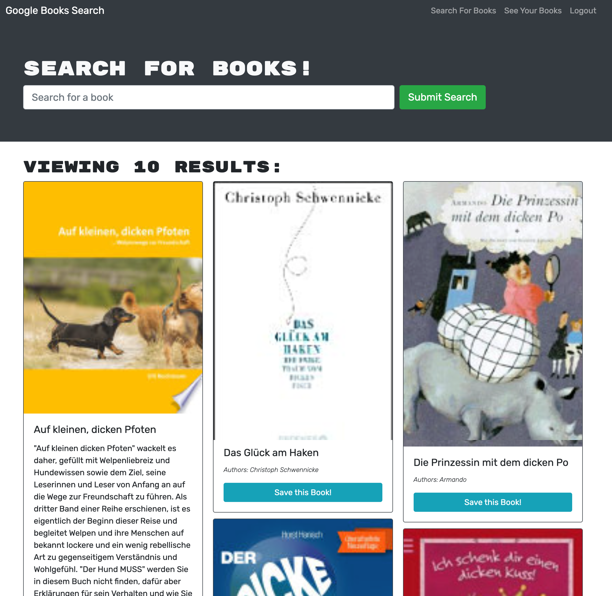

# Challenge 21: MERN Book Search Engine
The week 21 assignment of the ESMT Coding Boot Camp required that I take take a fully functioning Google Books API search engine built with a RESTful API, and refactor it to be a GraphQL API built with Apollo Server. The app was built using the MERN stack, with a React frontend, MongoDB database, and Node.js/Express.js server and API. 

## Screenshot

## Challenges
* Refactoring for GraphQL  
* Applying new learning of React
* Understanding syntax of queries and mutations
* Deploying to Heroku

## Gratitude
* Thanks to my personal coaches Tiffany Conroy and Morgan Roderick
## Contact
Tammi L. Coles [@tlcoles](https://github.com/tlcoles/)  
GitHub repo: [https://github.com/tlcoles/challenge-21-MERN-book-search](https://github.com/tlcoles/challenge-21-MERN-book-search)
Heroku deploy: [https://apples-pears-oranges.herokuapp.com/](https://apples-pears-oranges.herokuapp.com/) 